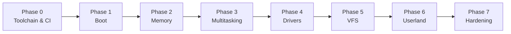

<div align="center">

# 🌙 Maleos Kernel

**A lightweight, modern hybrid kernel built for efficiency, modularity, and memory safety.**

*Monolithic speed. Microkernel stability.*

[Architecture](#-architecture) •
[Memory](#-memory-layout) •
[Scheduling](#-scheduling--ipc) •
[Roadmap](#-roadmap) •
[Getting Started](#-getting-started) •
[Debugging](#-running--debugging) •
[Contributing](#-contributing)

</div>

---

## ✨ Highlights

| | Feature | Description |
|---|---|---|
| ⚡ | **Hybrid design** | Performance-critical services in the core, risky components isolated behind clean boundaries |
| 🧩 | **Modular** | Subsystems communicate through well-defined interfaces and can evolve independently |
| 🛡️ | **Memory safe by design** | Strict paging, privilege separation, and guard-rail allocators from day one |
| 🔌 | **Portable core** | A Hardware Abstraction Layer keeps machine-specific code out of the kernel proper |
| 🔍 | **Debug friendly** | One-command QEMU + GDB workflow |

---

## 🗺️ Architecture

Maleos wraps an optimized kernel core around a flexible Hardware Abstraction Layer (HAL).

```text
┌───────────────────────────────────────────────────────────────┐
│                          USER SPACE                           │
│  ┌────────────────┐  ┌────────────────┐  ┌────────────────┐   │
│  │ User Apps/CLI  │  │ Native Utils   │  │  GUI Engine    │   │
│  └────────────────┘  └────────────────┘  └────────────────┘   │
├───────────────────────────────────────────────────────────────┤
│             System Call Interface  (syscall / sysret)         │
├───────────────────────────────────────────────────────────────┤
│                         KERNEL SPACE                          │
│  ┌────────────────┐  ┌────────────────┐  ┌────────────────┐   │
│  │ Process/Thread │  │ Virtual Memory │  │ Inter-Process  │   │
│  │ Scheduler      │  │ Manager (VMM)  │  │ Comm. (IPC)    │   │
│  └────────────────┘  └────────────────┘  └────────────────┘   │
│  ┌────────────────┐  ┌────────────────┐  ┌────────────────┐   │
│  │ Virtual File   │  │ Network Stack  │  │ Driver Shim    │   │
│  │ System (VFS)   │  │ (TCP/IP)       │  │ Layer          │   │
│  └────────────────┘  └────────────────┘  └────────────────┘   │
│  ┌─────────────────────────────────────────────────────────┐  │
│  │        Hardware Abstraction Layer (HAL) / Bootloader    │  │
│  └─────────────────────────────────────────────────────────┘  │
├───────────────────────────────────────────────────────────────┤
│                      PHYSICAL HARDWARE                        │
└───────────────────────────────────────────────────────────────┘
```

### Core Subsystems

| Subsystem | Responsibility |
|---|---|
| **System Call Interface (SCI)** | Secure gateway letting unprivileged applications request kernel services |
| **Process Scheduler** | Preemptive, priority-based scheduling of threads across time slices |
| **Virtual Memory Manager (VMM)** | Paging, memory protection, and physical/virtual allocation |
| **Inter-Process Communication (IPC)** | Message passing between isolated components and processes |
| **Virtual File System (VFS)** | Uniform file access across different storage formats |
| **Driver Shim Layer** | Stable driver interface that keeps drivers decoupled from the core |
| **Hardware Abstraction Layer (HAL)** | Isolates the kernel from machine-specific code |

---

## 🛣️ Roadmap

Development follows a strict, staged lifecycle so each layer is stable before the next is built on top of it.



> **Legend:** ⬜ planned · 🟨 in progress · ✅ done
>
> **Current status:** Phases 0–3 complete. Next up: Phase 4 (basic I/O drivers).

### Phase 0 — Foundations & Tooling
- ✅ Reproducible `x86_64-elf` cross-compiler setup (`scripts/build-toolchain.sh`)
- ✅ Build system (`Makefile`) with `iso`, `run`, `debug`, and `test` targets
- ✅ CI pipeline: build on every push, boot-test in headless QEMU
- ✅ Coding standards, repository layout, and contribution guide

### Phase 1 — Bootstrapping & Baseline
- ✅ Multiboot2-compliant boot via GRUB
- ✅ Transition into 64-bit long mode (PAE, NX, write-protect enabled)
- ✅ GDT with TSS, IDT, and CPU exception handlers (double fault on its own IST stack)
- ✅ Early console: VGA text driver
- ✅ Serial (UART) logging for headless debugging

### Phase 2 — Memory Management
- ✅ Parse the bootloader-provided memory map
- ✅ Physical Page Frame Allocator (4 KiB frames, bitmap, contiguous allocation)
- ✅ Virtual memory paging and higher-half kernel mapping (`0xFFFFFFFF80000000`)
- ✅ Kernel heap allocator (`kmalloc`/`kfree`, grows on demand, coalescing, corruption checks)
- ✅ Memory protection: NX bit, guard pages, W^X enforcement
- ✅ In-kernel self-tests (117 checks) run on every boot and in CI

### Phase 3 — Preemptive Multitasking
- ✅ Interrupt controller setup (legacy PIC masked, local APIC enabled; I/O APIC arrives with Phase 4)
- ✅ Timer integration (APIC timer, calibrated against the PIT) driving a 100 Hz scheduler tick
- ✅ Context switching with callee-saved register save/restore on per-thread kernel stacks (guard pages)
- ✅ Priority-based preemptive scheduler: 8 levels, strict priority, round robin within a level
- ✅ Synchronization primitives: irq-safe spinlocks, sleeping mutexes, semaphores, wait queues
- ✅ Kernel IPC: bounded message ports, timeouts, request/reply
- ✅ PMM, VMM, heap and `printk` made safe under preemption
- ✅ 179 in-kernel scheduler/IPC checks run on every boot and in CI

### Phase 4 — Basic I/O Drivers
- ⬜ PS/2 keyboard driver
- ⬜ PCI bus enumeration
- ⬜ Storage drivers: IDE/PATA, then AHCI
- ⬜ Driver Shim Layer API stabilized

### Phase 5 — Virtual File System
- ⬜ Core VFS abstractions (inode / vnode layouts)
- ⬜ Initial ramdisk (initrd) support
- ⬜ Lightweight on-disk filesystem (`ext2` or custom read-only index)
- ⬜ File descriptor table and basic file syscalls

### Phase 6 — Userland Execution
- ⬜ Privilege transitions via `syscall` / `sysret`
- ⬜ ELF binary loader
- ⬜ Per-process address spaces
- ⬜ First user process (`init`)
- ⬜ Interactive shell

### Phase 7 — Hardening & Expansion *(new)*
- ⬜ Kernel test suite and fuzzing of the syscall surface
- ⬜ Network stack (NIC driver, ARP, IP, TCP/UDP)
- ⬜ SMP (multi-core) support
- ⬜ Stack protector, KASLR, and other mitigations
- ⬜ Documentation site and a tagged `v0.1.0` release

---

## 🧠 Memory Layout

| Region | Virtual address | Permissions | Notes |
|---|---|---|---|
| Direct map (HHDM) | `0xFFFF800000000000` + phys | RW, NX | All RAM, 2 MiB pages |
| Kernel heap | `0xFFFFC00000000000` | RW, NX | Grows on demand, up to 256 MiB |
| Kernel image | `0xFFFFFFFF80000000` + phys | `.text` RX, `.rodata` R, `.data`/`.bss` RW+NX | Per-section W^X |
| Kernel stack guard | lowest page of the stack | unmapped | Overflow faults instead of corrupting memory |
| MMIO | `0xFFFFE00000000000` | RW, NX, uncached | Device registers via `vmm_ioremap()` |
| Thread stacks | `0xFFFFE80000000000` | RW, NX | 16 KiB each, unmapped guard page below every stack |

No mapping is ever writable and executable at once, and the boot identity map is removed after paging is set up.
Details and design notes: [docs/MEMORY.md](docs/MEMORY.md).

### Boot output

```text
Maleos kernel starting
GDT/IDT loaded
Physical memory map:
  [0000000000100000 - 000000000ffe0000) usable
  ...
PMM: 254 MiB usable, 254 MiB free (65160 frames)
VMM: kernel address space active, W^X enforced
Heap: 64 KiB mapped at ffffc00000000000
MALEOS BOOT OK
MM SELFTEST: PASS (117 checks)
APIC: id 0, timer 625274 ticks per 10 ms, 100 Hz scheduler tick
Scheduler: 8 priority levels, 30 ms quantum, preemptive
SCHED SELFTEST: PASS (179 checks, 827 context switches)
```

---

## 🧵 Scheduling & IPC

| Feature | Details |
|---|---|
| Scheduler | Preemptive, 8 strict priority levels, round robin within a level, O(1) pick |
| Tick / slice | 100 Hz tick, 30 ms time slice (APIC timer) |
| Threads | `thread_create`, `thread_join`, `thread_detach`, `thread_sleep_ms`, `sched_yield` |
| Locks | `spin_lock_irqsave`, `mutex_*`, `sem_*`, `waitq_*` |
| IPC | Bounded message ports with timeouts, plus `ipc_call` / `ipc_reply` |

```c
static void worker(void *arg) { printk("hello from %s\n", thread_current()->name); }

struct thread *t = thread_create("worker", worker, NULL, SCHED_PRIO_NORMAL);
thread_join(t);
```

Design notes, locking rules and limitations: [docs/SCHEDULER.md](docs/SCHEDULER.md).

---

## ⚙️ Getting Started

### Prerequisites

Install the build tools and emulation suite (Ubuntu / Debian):

```bash
./scripts/install-deps.sh
```

### Build Target

| Setting | Value |
|---|---|
| **Target architecture** | `x86_64-elf` (cross-compiled) |
| **Build system** | `Makefile` (auto-detects `x86_64-elf-gcc`, falls back to host GCC) |
| **Boot protocol** | Multiboot2 via GRUB |
| **Memory limit** | Up to 8 GiB of RAM is managed (`PMM_MAX_PHYS`) |
| **CPUs** | One (SMP comes in Phase 7) |
| **Emulator** | QEMU |

---

## 🚀 Running & Debugging

### Build the boot ISO

```bash
make iso
```

### Run in QEMU

```bash
make run
```

### Debug with GDB

```bash
# Terminal 1: start QEMU paused, listening on localhost:1234
make debug

# Terminal 2: attach GDB
gdb -ex "target remote localhost:1234" -ex "symbol-file build/kernel.elf"
```

### Quick reference

| Command | What it does |
|---|---|
| `make iso` | Compile and package a bootable ISO |
| `make run` | Boot the ISO in QEMU |
| `make debug` | Boot paused with a GDB server on port 1234 |
| `make test` | Headless boot test (what CI runs); try `MEM=2G make test` |
| `make format` | Format C sources with clang-format |
| `make clean` | Remove build artifacts |

---

## 🤝 Contributing

Contributions, bug reports, and ideas are welcome.

1. Fork the repository
2. Create a feature branch: `git checkout -b feature/my-change`
3. Commit with clear messages
4. Open a pull request describing what changed and why

See [CONTRIBUTING.md](CONTRIBUTING.md) and [docs/CODING_STANDARDS.md](docs/CODING_STANDARDS.md). Please keep changes scoped to the current roadmap phase where possible.

---

## 📜 License

Released under the **MIT License**. See the [LICENSE](LICENSE) file for details.

<div align="center">

*Built from the first instruction up.* 🌙

</div>
